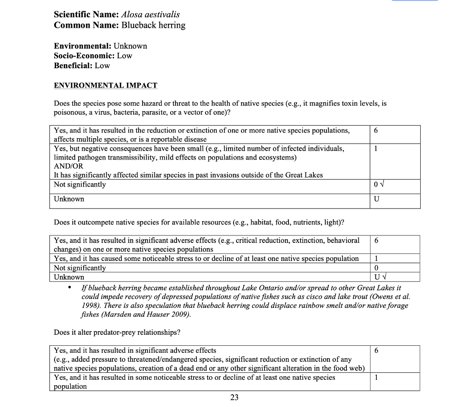
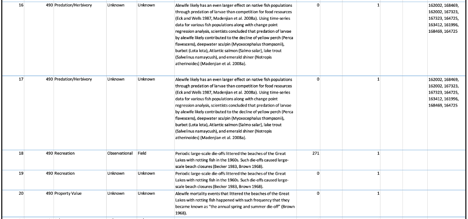
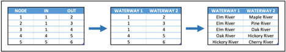
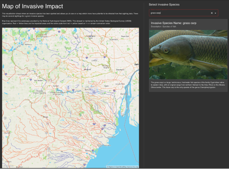
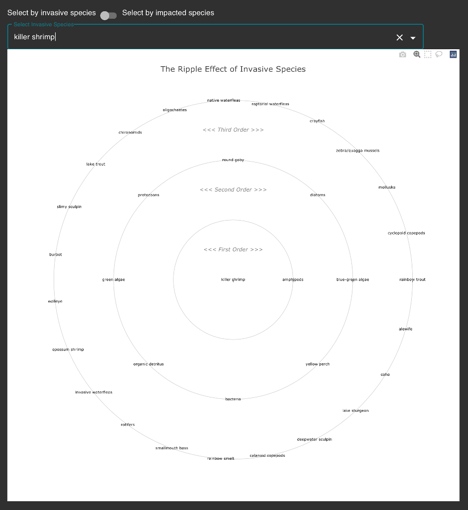
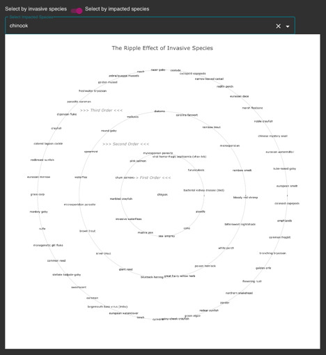
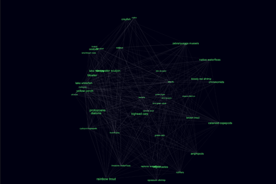

# 
The Ripple Effect

### 
Mapping the First to Third Order Effects of Invasive Species in the Great Lakes

### 
 Ermias Bizuwork  | Robert Bowman | Toby Kemp 

NOAA’s Great Lakes Environmental Research Laboratory (GLERL) is responsible for collecting invasive species information in the Great Lakes area. We partnered with them to structure, analyze, and visualize their records on invasive species.

> The current understanding of many marine species, their links to other components of the ecosystems, and the benefits they provide to society is limited; in many instances, scientists have virtually no data. Adequate assessments have been performed for fewer than 60 percent of the key fish stocks and complexes, fewer than 25 percent of all protected species, and an even smaller percentage of the habitat upon which all of these species depend. In addition, it is not yet fully understood how complex ecosystems or individual species will respond either to a changing climate or available approaches to managing living marine resources.  ~ [NOAA’s Goals](https://www.performance.noaa.gov/goals/)

## Invasive Species in Michigan Waterways
### Introduction

Michigan is famous for its lakes and rivers—its very shape is determined by the Great Lakes.  However, globalization is impacting the ecosystems of Michigan’s waterways by introducing invasive species, [costing more than $100 million annually](https://www.andersoneconomicgroup.com/Portals/0/upload/AEG%20-%20AIS%20Impact_%209-20-2016%20Public.pdf).  In addition, state and federal governments are spending enormous amounts of money to mitigate the impact of invasive species, for example, budgeting over [$858 million to prevent invasive carp from entering the Great Lakes](https://apnews.com/article/technology-lake-michigan-army-fish-chicago-7e40381283991c37eec7a08552daddf4).

Dealing effectively with these invaders requires information, not only about the invaders themselves but also about the ecosystem in which they inhabit and their relationships with other species.  Much of this information is unavailable, inaccessible, or unconnected to related data.

### Current State of Field

The information that is available comes primarily from researchers who document the behaviors and impacts specific species have on an ecosystem.  GLERL collects and organizes this information on invasive species in the Great Lakes region. Policy makers and researchers rely on the collected data to make regulations that maintain the health of America’s most prominent ecosystem.

Maintaining these records is not an easy task. GLERL scours everything from academic papers to homeowner association pamphlets to get the needed information and collects them into long (1000 page+) [technical reports and annual updates](https://www.glerl.noaa.gov/pubs/#techRep).  Reviewing the reports and associated research and entering the compiled information into their database has always been a challenge.

For our project, we structured, analyzed, and visualized GLERL records on invasive species.   As sportsman, conservationists, and data scientists we seek to maintain the beauty and vitality of Great Lakes waterways for our children and grandchildren.

## Increased Available Research Findings by 750%
### Structuring Data

We algorithmically processed 3,300 pages of technical reports and created 3,100 structured scientific findings that will be added to the [Great Lakes Aquatic Nonindigenous Species Information System (GLANSIS)](https://www.glerl.noaa.gov/glansis/), increasing their entries by over 750%.

The technical reports detail the potential impacts of invasive species on an ecosystem and are freely available on their website.

In order to make the information more accessible, GLERL dedicates a portion of their research database (GLANSIS) to records dealing with possible invasive species and their potential impact on the environment.  These records, called impact statements, are organized by invasive species and include information on the source of the findings and the other species impacted.

Converting the unstructured nature of the reports into the structured form of the impact statements has always been a challenge for GLERL. Our team processed more than six years of reports, combined them with ten other tables, and prepared a final file for entry into the database.

We located and extracted the text related to the impact statements, by reading the PDF files and converting them to plain text, and then used regex to locate section headings and key phrases and a naïve Bayes classification algorithm to extract relevant information. We matched 60% of the impact statements to references in GLERL’s database by extracting and normalizing their citations, matching them with references in the bibliography, and then to GLERL’s database.

Extracting and identifying the impacted species in each statement proved to be a challenge.  Species were referenced at different levels of taxonomic rank (kingdom, phylum, class, order, family, genus, and species) and sometimes by one of their many common names, so we quickly standardized our naming conventions.  With NOAA’s advice, we opted to use the naming conventions in the predator-prey relationships (see below). We built dictionaries to translate the names into a common ontology, and match up the species ID used to invaders and [TSNs](https://www.itis.gov/) to impacted species.

Each record was missing two critical values that could not be found in the technical reports: study type and study location.  These two values are based on the judgement of the researcher entering the report, and sometimes researchers do not agree.  We trained Random Forest Classifiers on existing impact statements and used them to impute the values for the impact statements we had extracted.  Through careful feature engineering and vectorization of the title, abstract, and journal, we were able to achieve a 73% accuracy for the study type and 80% for the study location with an 80-20 train-test split, with only 992 labeled examples, a value limited by the incomplete information about many of the references (missing abstracts, journals, etc.).  We retrained the classifier on the complete set and then imputed the data.

Lastly, we compiled a completed table and exported it in a correctly formatted Excel file for upload into the database.

### Notes, Lessons & Ethical Considerations
- Choose the Right Library: The libraries used to extract the text varied in extraction accuracy (90% to 100%) and processing time (30 min to 30 seconds) depending on the library used.  Test several options for performance before committing to a specific library.
- Beware Inconsistencies: We extracted information that had been compiled by hand and matched it to a specific data model. Differences in spelling, format, and spacing required careful consideration and introduced potential uncertainty into our findings.
- Information Availability: Organizations are sometimes reluctant to provided unfettered access to their data.  Clearly state your complete expectations and requirements for data access in the negotiation stage: come to a clear understanding before you proceed.
- Ontology Matters: The different levels present in the naming conventions of the species, references, and waterways (see below) made combining datasets more art than science.  Consult with domain experts and heed their advice.
- Understand Your Data: Datasets vary in a myriad of ways, including accuracy, completeness, and specificity.   Understand and clearly communicate the limitations of your data, so users can make informed decisions.
- Pipeline First: Quickly producing results in each step and learning how the datasets interact saves time downstream.  Follow the Pareto Principle and get the 80% done first—then go back and polish.
- Missing Data: Data collection varies considerably and is neither uniform nor random. The quantity of information collected does not reflect its impact. Review the density of data and clearly communicate what might be overlooked.

## Pioneered Network Model of Invasive Species
### Building Networks

Traditional databases relate tables to other tables, and when properly designed allow users to quickly determine direct relationships between entries.  However, finding indirect relationships between data and exploring the relationships between multiple entries in these systems is difficult.  Graphs explicitly model relationships between entries as a network, allowing users to explore direct and indirect relationships between multiple entries and opening up entirely new ways of analyzing systems.

### Species Network

We created a species graph that allows researchers for the first time to discover invaders impacting selected species and identify indirect relationships between species.

The species graph was based on the predator-prey relationships we extracted from GLERL’s foodwebs and represented as a two-column dataframe (predator, prey).  We normalized the species in the impacter-impacted relationships in the impact statements, combined it with the normalized predator-prey relationships, represented it as a graph using NetworkX.

To get a measure of how species impacted each other, we calculated the shortest path (if any) between each pair of species and saved the results as a three column dataframe.

### Waterways Network

We created a waterways invasion graph that lets researchers identify the possible risk of invasive species entering new waterways

We wanted to model regional lakes and rivers as a graph, so we could determine the potential spread of invasive species.  [USGS’s National Hydrography Dataset (NHDPlus HR)](https://www.usgs.gov/core-science-systems/ngp/national-hydrography/nhdplus-high-resolution)  includes a table of waterway intersections and waterways in and out.  To create our waterway network, we pruned and restructured the data as a table of paired waterways, one connected to the other, and then added the name of the waterway.

Next, we connected a list of invasive species observations GLERL maintains to another waterway network by downloading and flattening two geojson files, extracting 2 million geographical points representing regional lakes and rivers, and then used [ScyPy’s cKDTree](https://docs.scipy.org/doc/scipy/reference/generated/scipy.spatial.cKDTree.html) to find the closest waterway for each observation.  We mapped the waterway names to the waterway ID and outputted the result as a two-column waterway relationship table.

We created the network by importing the table into NetworkX, and then calculated the shortest distance between each species and waterway and saved it as a normalized table with three values (species, waterway, and distance) representing the potential spread of each invasive species in each waterway.

### Notes, Lessons & Ethical Considerations
- Standardize Representation:  Maintaining consistent representation of data is essential, particularly when dealing with multiple unstructured datasets.  Exploring your data and getting a pipeline working early on is essential for efficient progress.
- Use Graphs: The world is built of networks. Using graphs to represent data allows you to explore data in completely new ways and identify important indirect relations between entites that a database cannot.
- Uncertainty Cascade: The downstream effects of generalization and uncertainty grow over time.  As George Box said in 1978, “All models are wrong, but some of them are useful.”  The importance of communicating this clearly cannot be overestimated.
- Incomplete Research: NOAA’s foodwebs and the invasive impact findings are incomplete, so our networks should only be used as a starting point for research in these areas.  Lack of information does not equate to lack of relationship.
- Beware Unknown Basics: Information availability is independent of information importance.  With no information available on existing species in a waterway, we had to drop one main visualization.  Double check the availability of all data before you start.

## Made Models Accessible to Researchers
### Inventing Visualizations

We created easy-to-understand visualizations that allow researchers to explore the spread and impact of invasive species in Great Lakes waterways.

### Architecture

We used a thin, lightweight application on the front end housing the logic to make easy-to-use visualizations and display text with tools including React, React Ploytly.js, and React Mapbox-gl.js.  We built the layout using React and JSX, the logic and API requests with Javascript, and UI components outside the visualizations with Material-UI. Delivering only necessary data to the frontend allows the visualizations to load quickly and be viewed from anywhere
Internet is available.

To process most of the data, we set up the database as a Google Cloud Project (GCP) Cloud SQL using a PostgreSQL database.  For the backend, we use a Flask REST application with an MVC architecture exposing an API that serves necessary data to the frontend as a JSON object.  We use Kubernetes for continuous integration and continuous deployment (CICD) and GitHub actions to make the system easy to manage and change.

### River Plot

We created an interactive map showing the existence and potential spread of a selected invasive species.

Our waterway network was connected to the geojson file with named waterways.  Then, we mapped the existence and potential spread of invasive species onto vector tiles as layers on a map using Mapbox and represented the distance from an observation in a different layer with color allowing the map to render vast amounts of data very quickly.

As you can see above, grass carp are present in many rivers (shown in red) near the University of Michigan Campus in Ann Arbor.  In rivers shown in orange and yellow, the species has not yet been observed but there is a risk of invasion due to their connections to invaded waterways, while in rivers shown in blue, the risk is potentially limited by the lack of connected invader waterways.

### Ripple Plot

We invented the ripple plot which allows nth order relationships to be displayed in an easy-to-understand fashion and created an interactive version to display species relationships allowing researchers to see the direct and indirect impact of invasive species.

Displaying the first to third order species impacting or being impacted by invasive species in an easy-to-understand manner is completely new.  Until now, the information has never been available and, according to GLERL, this type of representation has never been used in the field.  In order to keep the visualization as simple as possible, we created a ripple plot that shows both the direct and indirect impacts of invasive species.

The plot above shows the direct and indirect impacts of a killer shrimp on the Great Lakes ecosystem directly impacting amphipods (1st order) and indirectly impacting bacteria (2nd order) and smelt (3rd order).

In the plot above, chinook is the impacted species and the concentric circles show invasive species that directly or indirectly impact it.  The first order impacting invaders directly impact the chinook and include alewife and pink salmon, while the second order invaders impact a species (invasive or not) that directly impacts chinook, and the third species impacts as species that impacts a species that impacts chinook.  Including only invaders focuses attention on changes to the pressure on a given species.

### Species Network

We created a network visualization tool showing how a single species relates to the other species in the ecosystem.

### Findings, Methodology & Ethical Considerations

- [Coastline Paradox](https://mathworld.wolfram.com/CoastlineParadox.html): The length of a coastline increases as the size of the ruler used to measure it decreases. Representing the network as a network of named waterways made the visualization easier to process and understand but ignored the potential impact of unnamed waterways. Focusing on individual segments would have preserved more locality and possible underfitted the data.  Understand the ruler you use, and its impact on the final results.
- Impact Complexity:  We represented impacts as one species impacting another, but relationships are rarely so one-sided.  The ease of understanding also limits a broader analysis.  Know and communicate the limitations of the representations you choose.
- Citation Omissions:  GLERL always cites the source of findings, but we opted for a simplified representation.  Adding links to the source of the data would properly credit the original findings and provide researchers with a more contextualized view.
- Inland Foodwebs: Foodweb data for inland waterways was not available, so our graph is incomplete.  Include the absence of data in your analysis and recognize your own limitations.
- Measuring Impact: The networks treat all impacts equally. Adding strength to the impacts between species or waterways, or representing the species as agents in an agent-based model would allow richer and more accurate representations of the data.
- Oversimplification: Our representations provide a starting point for research by simplifying a highly complex system. Simple representations should never be used by themselves to make large decisions.
- Lack of Peer Review: Our visualizations represent the data in GLERL’s database. However, they have not been reviewed by biological researchers, and the limitations of our approach have not been fully explored. Feedback from domain experts is priceless.

## Endless Possibilities
### Going Forward
- Database Management: Automating the database will speed its growth and potentially expand its reach.
- Inland Foodwebs: Adding foodwebs and species information for inland waterways will allow visualizations to be tailored to selected waterbodies.
- Link to Resources: Adding more information about the data itself and adding links to more information will aid researchers in gaining a more complete understanding of the ecosystem and aid in their research.
- Additional Graphs: Adding information on water quality or flow rates will both increase the accuracy of the model and allow more complex interactions to be identified and explored.

## Smarter Systems from Data
### Conclusion

By substantially Increasing the available findings in GLERL’s database, pioneering the representation of invader impacts and invaded waterways as networks, and inventing new tools for researchers to explore these relationships, we believe we have significantly advanced [GLERL’s mission to research ecosystem dynamics, integrate physical and ecological modeling and forecasting, and develop observing systems and technology](https://www.glerl.noaa.gov/).

We are confident that our findings and tools will contribute to a smarter, more integrated approach to ecological data, guide future research, and provide a basis for future systems.  More importantly, we believe it will be leveraged to protect and conserve the ecosystems of Great Lakes waterways for ourselves and our descendants.

For more information, visit our [website](the-ripple-effect.app) and [GitHub](https://github.com/MadsCapstone).

## References:
- [NOAA's Goals](https://www.performance.noaa.gov/goals/)
- [NOAA's Great Lakes Environmental Research Laboratory (GLERL)](https://www.glerl.noaa.gov)
- [Great Lakes Aquatic Nonindigenous Species Information System (GLANSIS)](https://www.glerl.noaa.gov/glansis/)
- [GLERL's Technical Reports & Memoranda](https://www.glerl.noaa.gov/pubs/#techRep)
- [USGS’s National Hydrography Dataset (NHDPlus HR)](https://www.usgs.gov/core-science-systems/ngp/national-hydrography/nhdplus-high-resolution)
- [The Cost of Aquatic Invasive Species to Great Lakes States](https://www.andersoneconomicgroup.com/Portals/0/upload/AEG%20-%20AIS%20Impact_%209-20-2016%20Public.pdf)
- [Deal reached on project to protect lakes from invasive fish](https://apnews.com/article/technology-lake-michigan-army-fish-chicago-7e40381283991c37eec7a08552daddf4)
- [GLERL's Research Programs](https://www.glerl.noaa.gov)

## Creators
- **Ermias Bizuwork** (Chief Technology Officer): Created the backend, mapped the invaders, and built the website.
- **Rob Bowman** (Chief Marketing Officer): Scraped the technical reports and created the video.
- **Toby Kemp**: (Chief Product Officer): Scoped the project, integrated the data, and wrote the blog.

